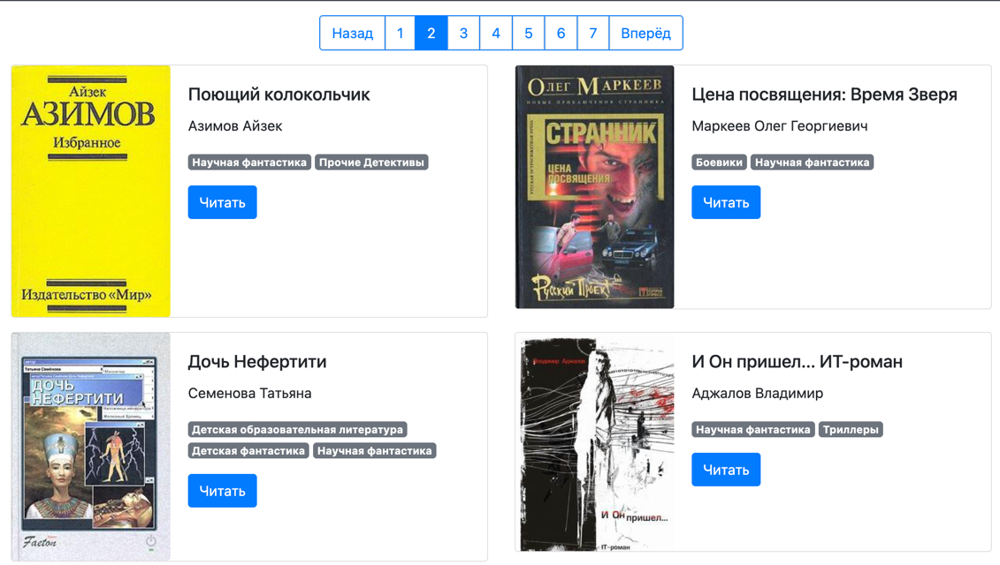

# Онлайн библиотека

- Ссылка на сайт - https://sergeykozyr.github.io/library/pages/index1.html

## Оффлайн запуск
1. Скачать проект
2. Открыть в браузере файл `library/pages/index1.html`

## Локальный запуск
1. Установить зависимости
```shell
pip install poetry
poetry install
```
2. Активировать виртуальное окружение
```shell
eval $(poetry env activate)
```
3. Запустить скрипт `python render_website.py`
4. Перейти на http://localhost:5500 и убедиться что сайт работает
5. Источник данных - файл meta_data.json, содержит данные книг в формате:
```json
    {
        "title": "Роковой поцелуй",
        "author": "Патрацкая Наталья",
        "img_src": "img/nopic.gif", - путь до обложки
        "book_path": "books/5648-Роковой поцелуй.txt", - путь до полного текста
        "comments": [],
        "genres": "Научная фантастика, Прочие Детективы, Прочие приключения."
    }
```
## Цели проекта

Код написан в учебных целях — это урок в курсе по Python и веб-разработке на сайте [Devman](https://dvmn.org).